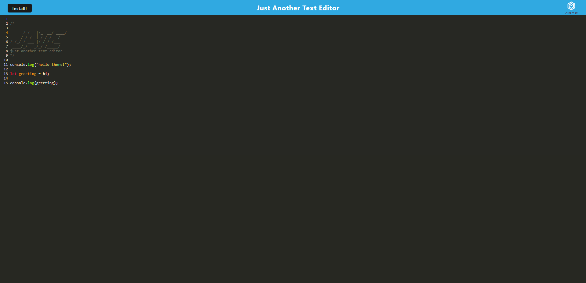

# pwa-text-editor

This is a PWA text editor that allows you to write code with COLORS, and auto-saves your work. There is an install button so you don't have to visit our website anymore, the application can be opened directly on the desktop after being installed.


## Table of Contents

-[Installation](#installation)

-[Usage](#usage)

-[Screenshots](#screenshots)

-[Resources](#resources)

-[License](#license)

-[Deployed](#deployed-website)

## Installation

Open Integrated Terminal at BOTH level of "Develop" and "server", then run command:

```sh
npm i
```

## Usage

Open Integrated Terminal, then run command:
```sh
npm run start:dev
```
## Screenshots


## Resources
Instructor: Drew Hoang
TA: Michael Scharf

## License

[](https://opensource.org/licenses/MIT)

This project is licensed under the terms of the MIT license.

## Deployed Website
https://jake-the-cat.herokuapp.com/